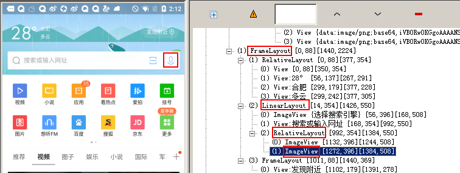
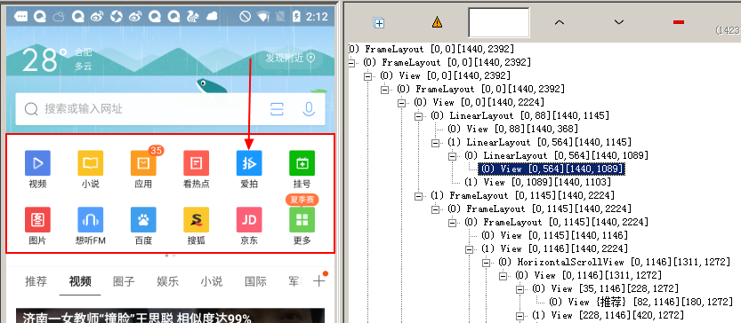

# 常见问题
- adbui 交流微信群，加 hao1032，备注 adbui，会拉入微信群
- 使用 ocr 提示出错，请在该页面最后查看使用 ocr 示例

# adbui
adbui 所有的功能都是通过 adb 命令，adbui 的特色是可以通过 xpath，ocr 获取 ui 元素。

## 安装
    pip install adbui

## 要求
- 在命令中可以使用 adb 命令，即adb已经配置到环境变量
- adb 的版本最好是 >= 1.0.39，用老版本的 adb 可能会有一些奇怪的问题
- 依赖的库：lxml 解析 xml，requests 发 ocr 请求，pillow 图片处理

## 说明
- adbui 当前还在完善，bug 和建议请直接在 github 反馈
- 主要在 win7，python3 环境使用，其他环境可能有问题

## import and init
    from adbui import Device

    d = Device('123abc')  # 手机的sn号，如果只有一个手机可以不写

## adbui 可以分为 3 个部分
**util 负责执行完整的命令**

  - **cmd** 用来执行系统命令
  
        d.util.cmd('adb -s 123abc reboot')
        out = d.util.cmd('ping 127.0.0.1')
    
  - **adb** 用来执行 adb 命令
  
        d.util.adb('install xxx.apk')
        d.util.adb('uninstall com.tencent.mtt')
    
  - **shell** 用来执行 shell 命令
  
        d.util.shell('pm clear com.tencent.mtt')
        d.util.shell('am force-stop com.tencent.mtt')

**adb_ext 对常用 adb 命令的封装，下面列出部分操作（可在 adbui/adb_ext.py 文件自行增加需要的操作）**

  - **screenshot**
   
        d.adb_ext.screenshot() # 截图保存到系统临时目录，也可指定目录
        
  - **click**
  
        d.adb_ext.click(10, 32)  # 执行一个点击事件 
        
  - **input**
  
        d.adb_ext.input('adbui')  # 输入文本 
        
  - **back**
  
        d.adb_ext.back()  # 发出 back 指令 

**get_ui 可以通过多种方式获取 UI**
  - **by attr** 通过在 uiautomator 里面看到的属性来获取
  
        ui = d.get_ui_by_attr(text='设置', desc='设置')  # 支持多个属性同时查找

        ui = d.get_ui_by_attr(text='设', is_contains=True)  # 支持模糊查找

        ui = d.get_ui_by_attr(text='设置', is_update=False)  # 如果需要在一个界面上获取多个 UI， 再次查找时可以设置不更新xml文件和截图，节省时间

        ui = d.get_ui_by_attr(class_='android.widget.TextView')  # class 在 python 中是关键字，因此使用 class_ 代替

        ui = d.get_ui_by_attr(desc='fffffff')  # 如果没有找到，返回 None;如果找到多个返回第一个

        ui = d.get_uis_by_attr(desc='fffffff')  # 如果是 get uis 没有找到，返回空的 list
    
  - **by xpath** 使用 xpath 来获取
        
  
        mic_btn = d.get_ui_by_xpath('.//FrameLayout/LinearLayout/RelativeLayout/ImageView[2]')  # 获取麦克风按钮
        mic_btn.click()  # 点击麦克风按钮
        
        # adbui 使用 lxml 解析 xml 文件，因此 by xpath 理论上支持任何标准的 xpth 路径。
        # 这里有一篇 xpath 使用的文章：https://cuiqingcai.com/2621.html
        
        # 另外获取的 ui 对象实际是一个自定义的 UI 实类，ui 有一个 element 的属性，element 就是 lxml 里面的 Element 对象，
        # 因此可以对 ui.element 执行 lxml 的相关操作。
        # lxml element 对象的文档：http://lxml.de/api/lxml.etree._Element-class.html
        
        scan_element = ui.element.getprevious()  # 获取麦克风的上一个 element，即扫一扫按钮
        scan_btn = d.get_ui_by_element(scan_element)  # 使用 element 实例化 UI
        scan_btn.click()  # 点击扫一扫按钮

  - **by ocr** 使用腾讯的OCR技术来获取
        
        
        d.init_ocr('10126986', 'AKIDT1Ws34B98MgtvmqRIC4oQr7CBzhEPvCL', 'AAyb3KQL5d1DE4jIMF2f6PYWJvLaeXEk')
        # 使用 ocr 功能前，必须要使用自己的开发密钥初始化，上面的密钥是我申请的公共测试密钥，要稳定使用请自行申请
        # 腾讯的 ocr 功能是免费使用的，需要自己到 http://open.youtu.qq.com/#/develop/new-join 申请自己的开发密钥
        
        btn = d.get_ui_by_ocr(text='爱拍')  # 找到爱拍文字的位置
        btn.click()  # 点击爱拍

## Change Log
20210418 version 3.5.2
- 增加 minicap 截图

20210325 version 2.6
- dump xml 优先使用 --compressed 模式

20210325 version 2.4
- 修复python3.8以上版本找控件报错 RuntimeError: dictionary keys changed during iteration

20200402 version 1.0
- 修改screenshot 参数情况
- 去掉 cmd out save 函数
- init ocr支持keys传入多个key

20200328 version 0.40.1
- 修改 push pull 方法等参数
- 使用 timeout 库控制超时
- get ui by orc 去掉 min hit 参数，增加 is contains 参数